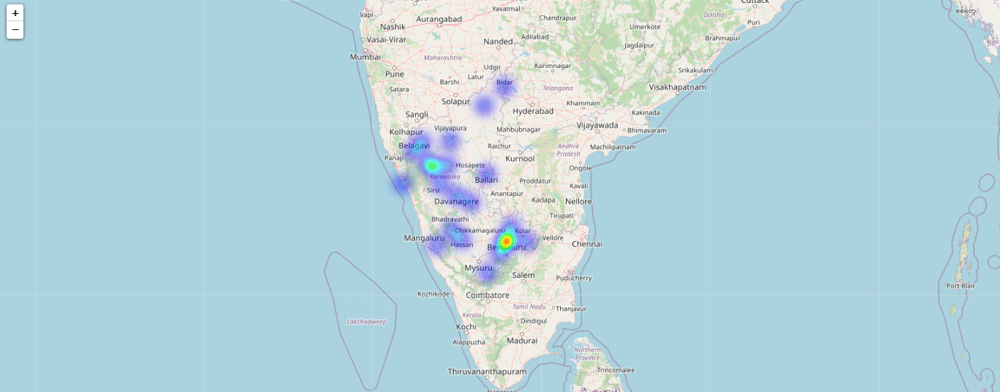
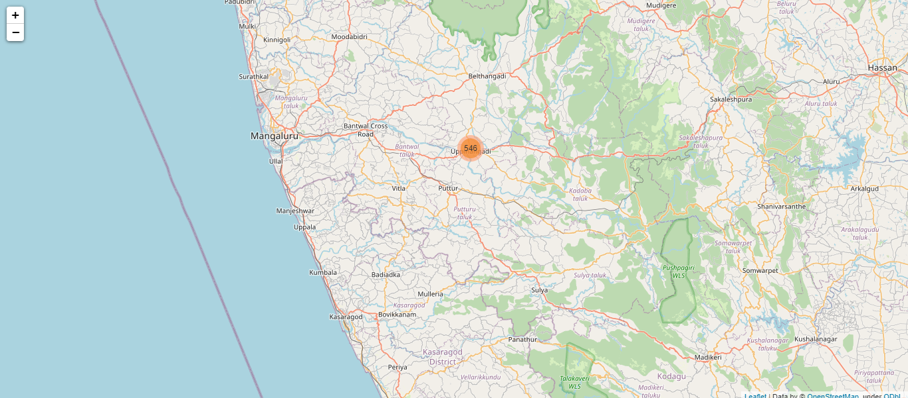
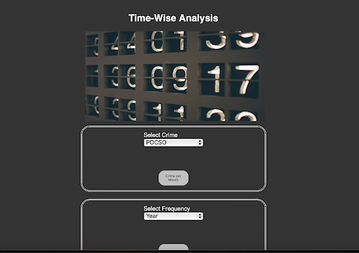
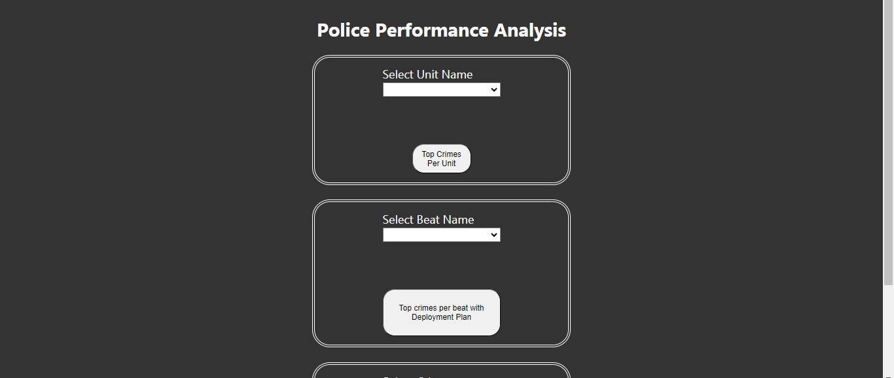

# Predictive Crime Analysis First Prototype Using Flask
* Author: Leena Goyal [@Leena2403](https://www.github.com/Leena2403) and Souryadeepta Majumdar [@majumdarsouryadeepta](https://www.github.com/majumdarsouryadeepta)
* Created on: April 12, 2024
* Description: Data analysis, exploration & visualization on crime incidents in Karnataka
* Curated dataset: Provided by KSP

#### Main Interface Look 

**Note** 
The web app is still under construction. The authors are in the process of updating and bulding the complete web app.
  

# Solutions Provided

- Spatial analysis of the crime, distribution of crimes over a particular location, and crime hotspots.

- Location-based analysis of the crimes, beat-wise distribution of crimes.

- Trend of occurrence of crimes at a particular time or in a particular day/month/season of the year.

- Analysis of the accused age, occupation, socio-economic status, location, etc., and prediction of criminal behavior.

- Analysis of the victim, socio-economic background, gender, location, and prediction of vulnerable populations and areas.

- Comparison of beat duties, patrolling areas with that of the crime occurrence, and analyzing the performance of the police.

# Crime Datasets

The datasets provided and used include 

- **FIR Dataset**
    - 2016 - 2024
- **Accused Dataset**
    - 2016 - 2024
- **Victim Dataset**
    - 2016 - 2024
- **Arrest Dataset**
    - 2016 - 2024
  

The data ranges from 01/2016 to 02/2024. The goal is to try to predict the category of crime that occurred in the various districts of Karnataka. Alongside, comprehensive accused analysis and victim analysis is made. Dynamic and interactive spatial and location based analysis is present.

Using Scikit Learn, predictions have been made for both crime and criminal analysis. Proper Victim Analysis has also been done.

## Dataset
Dataset contains incidents derived from KSP Crime Incident Reporting system. The data ranges from **2016 to 2024** (~8 years worth of data). 

## Interface
- The whole interface has been created using Flask, HTML, CSS and JavaScript. Six different categories of analysis has been provided `District Analysis, Crime Analysis, Time Analysis, Criminal Analysis, Victim Analysis, Beat/Police Analysis`. For each of the category, comprehensive and useful analysis, prediction and maps have been implemented.

- **HTML**: HTML5 has been used throughout that uses forms and buttons for responsive collections of several inputs. Each and every page is linked to each other using relative hyperlinks and static images are being used to throughout to maintain a constant size of the overall website. For displaying graphs, canvas is used with an integration of chart.js library. Each and every components of the webpages are being organized through divs.

- **CSS**: The overall structuring and design of the website is enhanced with css with proper shaping of the containers, hover effects and also the color combination of the webpage during light and dark modes.

- **JS**: Overall responsiveness is being catered through NodeJS that usually uses the inputs and contains the defined functions to process and display the desired outputs. These functionalities are being used to create responsive charts for each combination of analysis and also acts as the bridge between HTML and Flask.

- All the images have been taken from Unsplash for the use case in our project.

The python files for each of the container is being provided for customising each page differently, and suited to its needs. Dedicated functions are presented, and following is the list of the files present in the directory.

**Data Preparation for Analysis**

`files_generator` function prepares data for analysis by reading relevant CSV files and extracting unique values for various attributes.

- **Data Sources**:
  - `FIR_Details_Data.csv`: Contains details of FIRs (First Information Reports).
  - `AccusedData.csv`: Contains details of accused individuals.

- **Data Extraction**:
  - `years`: Unique years present in the FIR dataset.
  - `crimeno`: Unique crime numbers present in the FIR dataset.
  - `firno`: Unique FIR numbers present in the FIR dataset.
  - `arrestid`: Unique arrest IDs present in the accused dataset.
  - `districts`: Unique district names present in the FIR dataset.
  - `unitid`: Unique unit IDs present in the FIR dataset.
  - `crimehead`: Unique crime head names present in the FIR dataset.
  - `crimegroup`: Unique crime group names present in the FIR dataset.
  - `unit_name`: Unique unit names present in the FIR dataset.
  - `beatname`: Unique beat names present in the FIR dataset.

- **File Generation (Optional)**:
  - This function optionally generates text files containing the unique values for certain attributes.

## Folders
**Visualisationss**
- [Visualisations](https://github.com/Leena2403/predictive-crime-analysis-first_prototype/tree/main/Visualisations) - The main visualisations from our web app providing the png files for bar graphs, line plots, and maps.
 - The main visualisations from our web app providing the png files for bar graphs, line plots and maps.
- Districtwise plotting of crime along with the heat maps is present.
- Vulnerable crime areas are included using records of victim analysis. Folium is being used to display the auto-generated html files.

**Templates**

- [Templates]((https://github.com/Leena2403/predictive-crime-analysis-flask/tree/main/templates)) - Link to the `templates` folder in the repository.

- Folder contains the html files used in the `main.py` file.
- Html files relevant for different functions are automatically generated and saved in the templates folder upon each request sent from the main file.

**Crime Prediction**
- [Crime Prediction](https://github.com/Leena2403/predictive-crime-analysis-first_prototype/blob/main/crime_prediction.py) - Link to the `crime_prediction.py` file in the repository.
 - folder containing the hyperparameter tuning results (accuracy score & mean squared error) at each iteration of different machine learning models.
- Crime Prediction is using regression models; Decision Tree Regression and XGBoost Regression for predicting the number of crimes for particular crime head mentioned in FIR dataset. Using hyperparameter tuning outputs, the output is toggled between the abovementioned models based on their accuracy scores and mean squared error. The model is able to achieve almost 99% accuracy scores.
- Criminal Prediction is using Random Forest Classifier to predict the criminal behavior based on certain parameters like crime history, that helps in identifying the type of crime that can be committed by the criminal. This is currently a low accuracy model due to discrepencies faced for data quality and can be improved by further upgrading the data.
- Criminal Prediction Original is a heavier and more accurate model of criminal prediction which uses a similar approach as the previously mentioned point, but it refers to three distinct datasets; `VictimInfoDetails, FIR_Details_Data, Accused_Person_Info`. This helps in analysing the socio-economic background, age, profession, caste, etc. of the criminal and the intended motives as well as injuries incurred by the criminal.
- Districtwise crimes uses Linear Regression, Decision Tree Regession and Random Forest Regression for providing an estimated count of crimes for particular district in upcoming year. Hyperparameter tuning is used on accuracy scores & mean-squared-error to produce the most accurate count of crimes.

**Criminal Prediction**
- [Criminal Prediction](https://github.com/Leena2403/predictive-crime-analysis-first_prototype/blob/main/criminal_prediction.py) - Link to the `criminal_prediction.py` file in the repository.
- Criminal prediction is uses a combination of parameters like District, Unit name, month, year and crime no. and accordingly filters the dataset to fetch the probable criminals for a possible crime. Further it uses conditional probability to compute a statistical model called "Confidence Matrix". The graph and tabular output is hence computed as a result.
- The Arrested Person's id is used to fetch the information of a previously arrested criminal. This helps in spotting a criminal easily.
- The Predictive Criminal Analysis uses FIR number, Unit ID and Crime Number and further uses Random Forest Classifier to provide the possible Crime commited by the criminal and hence helps in finding the crimes that a criminal can commit.

**Deployment Plan AI**

- [Deployment Plan](https://github.com/Leena2403/predictive-crime-analysis-first_prototype/blob/main/DeploymentPlan.py) - Link to the `DeploymentPlan.py` file in the repository.
- Clustering of the crime heads is achieved by approaching K-means clustering. A thorough elbow-analysis is conducted in order to retrieve the ideal cluster size, which came out to be 18 in this specific case. A new dataset which contains the crime head corresponding to its cluster is created and stored for ease of access namely cluster_dict. Using clustering information different prompts have been stored in an array which has been using supportive prompts from pre-existing GenAI models; ChatGPT 3.5 Turbo. API approaches were made, however, it couldn't be successfully deployed due to the current upgradation discrepencies from the organisations. However, API based services can be still integrated in the current model, once the services resume. Till then the self-built array provides a comprehensive solution to each and every clustered crimes.
- Each deployment plan is provided for each beat that is chosen by the user and is flexible enough to provide a deployment plan for any range of locations.
- Each plan has a group of suggestions which not only provides the needful information for the police but also suggests the interactive activities that are being needed to involve the community and educate the potential victims hence spreading awareness, providing a holistic approach to the intended audience.

**Crime Analysis**

The `crimes_map` function is designed to perform crime analysis and takes the following parameters:

- `crime_name`: A string representing the name of the crime being analyzed.
- `year`: An integer representing the year for which the analysis is conducted.
- `df`: Optional parameter representing the dataset to be analyzed. Default value is `dataset`.

The function returns the top 5 districts in which the selected crime predominates.

This analysis is useful for monitoring and keeping checks on districts based on crime trends.

**Criminal Analysis**

The `compute_confidence_matrix` computes a confidence matrix for top criminals based on provided criteria such as district, unit name, crime number, month, year, and gender.

It first retrieves relevant data using the get_criminal function, then calculates frequency tables and past data using helper functions `get_freq_table` and `get_probability`. After computing confidence values, it ***normalizes*** them and generates a bar plot representing the confidence matrix. Finally, it saves the plot as an image file and returns the filename.

The analyis is useful for analyzing and visualizing the confidence levels of top criminals based on historical crime data. It helps law enforcement agencies or crime analysts to identify individuals who are more likely to commit crimes in a specific district, unit, or time period. By computing and visualizing these confidence values, authorities can prioritize their resources and efforts towards monitoring or apprehending high-risk individuals, thereby potentially preventing future crimes and enhancing public safety. Additionally, the function aids in understanding patterns and trends in criminal activities, allowing for more informed decision-making in law enforcement strategies and interventions.

The `criminal` function is designed to retrieve and analyze crime data associated with a specific arrest ID. It accepts parameters such as the arrest ID, individual's name, age, and crime number to filter and fetch relevant data from the dataset.

Here's a breakdown of its functionality:

***Parameters***:
- `Arr_ID`: The arrest ID for which crime data is to be retrieved.
- `name`: Optional parameter to filter data based on the individual's name.
- `age`: Optional parameter to filter data based on the individual's age.
- `crime_no`: Optional parameter to filter data based on the crime number.

**Data Analysis**:
If specific criteria such as the individual's name, age, or crime number are provided, the function performs additional analysis.
It visualizes the distribution of crimes committed by individuals of different ages using a bar plot (`bg_details function`).
It checks for injuries associated with the arrest ID in the FIR dataset and generates a pie chart to display the types of injuries (`get_injury function`).

If no specific criteria are provided or if the specified criteria do not yield results, the function generates a pie chart displaying the distribution of crimes based on crime groups (`pie_chart function`).

This function is useful for conducting detailed analyses of crime data associated with specific arrest IDs, allowing users to explore patterns, trends, and correlations within the dataset. Additionally, it provides visualizations to aid in understanding and interpreting the crime data more effectively.

**Time Analysis**

`year_wise_map` function generates a year-wise crime map using Folium, a Python library for visualizing geospatial data.

- **Data Source**:
  - `FIR_Details_Data.csv`: Contains details of FIRs (First Information Reports).

- **Input**:
  - `year`: The year for which the crime map is to be generated.
  - `df`: DataFrame containing FIR details.

- **Output**:
  - HTML file (`timemap.html`) containing the generated crime map.

- **Functionality**:
  - Filters the FIR dataset based on the input year.
  - Identifies the top 5 districts with the highest number of reported crimes for the specified year.
  - Generates a map centered around Karnataka with a zoom level of 10.
  - Places markers on the map corresponding to the locations of reported crimes in the top 5 districts.
  - Each marker includes information such as the police station name, beat name, date/time of the offense, and address.

- **Map Customization**:
  - The latitude and longitude coordinates of each district are predefined in the `lat_long_dict` provided in the file itself.
  - Marker clustering is implemented to improve map readability for densely populated areas.

- **Note**:
  - The generated map is saved as an HTML file in the `templates` directory for rendering in a web browser.

**Victim Analysis**

`generate_top_districts_map` function generates a map showing the top districts with the highest count of a specified crime.

- **Input**:
  - `crime_name`: Name of the crime for which the map is generated.
  - `df`: DataFrame containing FIR details.
  
- **Output**:
  - HTML file (`vulnerable_map.html`) containing the generated map.
  
- **Functionality**:
  - Filters the DataFrame to select FIRs related to the specified crime.
  - Determines the top districts with the highest count of the specified crime.
  - Creates a Folium map centered around Bengaluru with a zoom level of 10.
  - Places markers on the map corresponding to the top districts, indicating the district name and crime count.
 
This function is useful for identifying the districts with the highest incidence of a specific crime. It helps law enforcement agencies and policymakers understand the geographical distribution of crime, allowing them to allocate resources more effectively. By visualizing crime hotspots, this function aids in the development of targeted crime prevention strategies and deployment of law enforcement personnel.

`crimes_maps` function generates a crime map showing the locations of reported crimes for a specified crime and year.

- **Input**:
  - `crime_name`: Name of the crime for which the map is generated.
  - `year`: Year for which the map is generated.
  - `df`: DataFrame containing FIR details.

- **Output**:
  - HTML file (`crimemap_year.html`) containing the generated map.
  
- **Functionality**:
  - Filters the DataFrame to select FIRs related to the specified crime and year.
  - Identifies the top 5 districts with the highest number of reported crimes for the specified crime and year.
  - Creates a Folium map centered around Karnataka with a zoom level of 10.
  - Places markers on the map corresponding to the locations of reported crimes in the top 5 districts.
  - Displays the total count of the specified crime in the selected year on the map.

This function is valuable for analyzing crime trends over time and space. It enables stakeholders to visualize the spatial distribution of crimes for a particular crime type and year. Law enforcement agencies can use this information to identify areas of high criminal activity, allocate resources, and plan targeted interventions. Additionally, policymakers can utilize crime maps to assess the effectiveness of crime prevention measures and prioritize areas for intervention based on crime incidence.

#### Heatmap of districts given category of crime

#### District Analysis

#### Criminal Analysis

#### District Map Based on Crime

#### Histogram of Crimes

#### Time Analysis

#### Police Analysis

